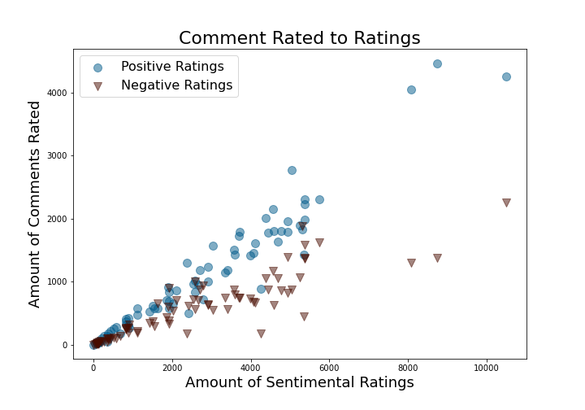
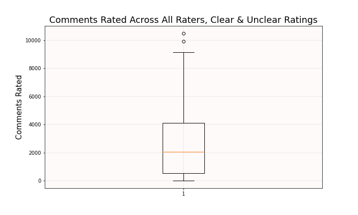
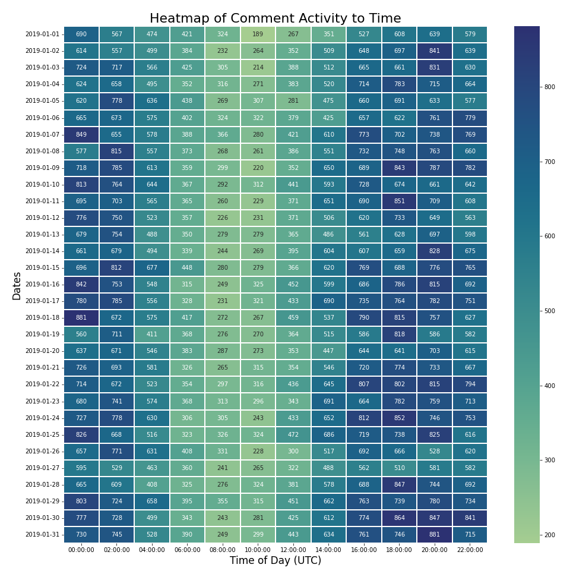
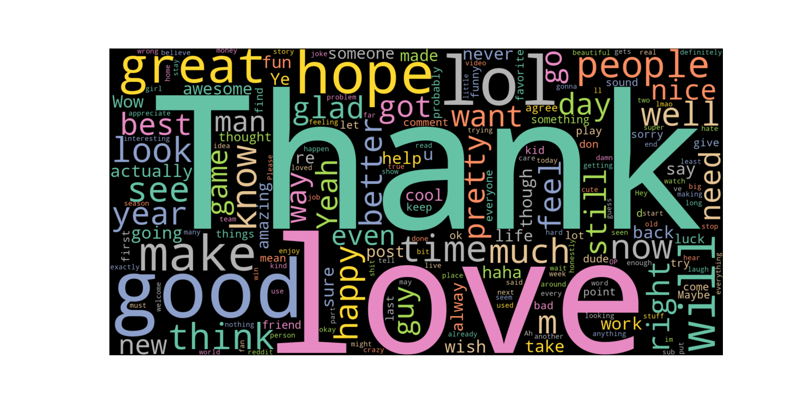

# project-1-repository

### Introduction:  
Our group engaged with a data set called GoEmotions, which was used by Software Engineers at Google Research to produce analysis in the form of a blog and supporting article titled GoEmotions: A Dataset of Fine-Grained Emotions.  
In this analysis, 58,009 Reddit comments were extracted from popular English-language subreddits then rated by 82 raters who rated which emotions were detected in each comment for a total of 211,223 rates. If raters could not be certain about any emotion being expressed in the comment, they were to select 'Neutral'. All of the 27 emotions are then grouped into Sentiments (Positive, Negative, and Ambiguous) based on their emotional leaning. The Neutral rates were treated as their own separate sentiment by the original analysts. After cleaning, our group further categorized the data by placing each subreddit into groups based on similar function and topic. Our groups are Emotive, Identity, Sports, TV/Movie, Relationship, Drugs, and Finance. This was to see if certain groups leaned towards a certain sentiment. Since neither the emotions nor sentiments were included as columns in the data set, we had to use numpy.select to assign each rating to its corresponding emotion and sentiment. We used Boolean commands embedded within a series within a list to count each column with a rate, assigned them to their respective emotions or sentiments using a list and then sent the output to the new columns.      

### Regarding Subreddits:  
Do certain subreddits / groups lean towards a range of emotions? What sort of emotional responses are elicited from certain types of subreddits?  
We organized the subreddits into groups based on common topics and functions, so they can be compared with different groups. The group labels are as follows: "Games", "Digital Media", "Discussion", "Emotive", "Identity", "Sports", "TV/Movie", "Relationship", “Finance”, “Drugs”. We have stacked bar charts showing the number of rates for each group within each sentiment (Positive, Neutral, Negative, and Ambiguous)  
- All groups rate predominantly positive ranging from 36.3% (Emotive) to 48.5% (Relationship). The second most common sentiment in all groups is Neutral, ranging from 22.6% (Relationship) to 28.6% (Sports). The third most common sentiment is Negative, ranging from 18.3% (Relationship) to 23.7% (Emotive). Lastly is Ambiguous in across all groups, ranging from 10.2% (Sports) to 12.4% (Emotive)   
- Among all of the Neutral ratings, the Emotive group takes the majority with 20% of the ratings with Discussion following closely behind at 19.5%. The least amount of Neutral ratings is from Drugs at 0.2%.   
- Among all of the Positive ratings, the Discussion group takes the majority with 20.8% of the ratings followed by Identity with 18.4%, while Finance has the least ratings at 0.2%   
- Among all of the Negative ratings, again the Discussion group takes the majority with 21.5% of the rates with the Emotive group following closely behind with 20.7% of the rates. The least amount of Negative ratings is from Drugs at 0.3%.  
- Among all of the Ambiguous rates, the Emotive group has the majority with 21.2% of the rates followed closely by Discussion at 20.1%. The minority is Drugs with 0.2% of the rates.    

### Regarding Raters: 
- 82 raters going over 58,000 comments, some of which are rated multiple times, for about 210k entries in the entire dataset.   
- Not every entry contains an emotional rating; some of them were excluded because the example was “unclear”, leaving us with 207k clear ratings. Our analysis focuses on clear ratings only.   
- The average rater gave 2528 ratings. The median rater gave 2061 ratings. The mode is 2587 ratings, which shows up twice.   
- The top 3 raters rated 10.5k, 8.7k and 8.1k comments for a total of 27.3k ratings. These three raters make up 13% of the 200k or so rows.  
- The raters kept the ratio of both sentiments consistent across comments rated.  
- Subreddit group representation is accurate across top and mode raters then becomes increasingly inaccurate near bottom raters, as one can expect. Can assume that the comments were unlikely to be preselected.    

### Regarding Date & Time:  
What impact does the date and time of day have on comment elicited emotion? Is there a trend based on the day and time of the comment made?  
- Higher positive sentiment right after New Years and at the end of January, unfortunately due to relativel short timescale we are unable to pursue this further.   
- Based on the heatmap, we can see that most comments were made between the hours of 12:00am - 2:00am and 4:00pm -10:00pm, due to lack of geographic data we cannot determine the timezones and adjusted hours of activity.    

### Regarding Emotion / Sentiment and Words:  
- We created Word Clouds based on the comments in our data. The larger the word in the visual, the more often the word is used in the specific group of comments. We were curious to see if certain words appeared more often than others. It is interesting to note that the word clouds match what you would expect to see from Positive and Negative Sentiments and the Sports Subgategory. The other cloud words we created also had the same expected output. The words used most often make sense in relation to the subgroups.     

### Summary: 
When we started working with this data set, we expected more deviation between the emotions or effects of the comments.  
We asked ourselves questions based on our curiosities and came to the following conclusions:  
1. There is more gravitation towards a certain emotion, which we found to be the emotions categorized as positive. It is important to note that the dataset is curated, so this is not an accurate representation of the social media itself. 
2. The raters were surprisingly consistent with how they reacted to the comments.  
3. There is a trend for the time of day when comments are made. Depending on the sentiment, certain words appear more often than others. Again, it is important to note the dataset has been curated.  
4. The more we dove into the data, the more we realized the researchers curated the comments in ways to remove large deviations.    

[Use Case for Dataset - Predicting emotions based on data built upon Reddit Comment and Raters](https://huggingface.co/arpanghoshal/EmoRoBERTa)
